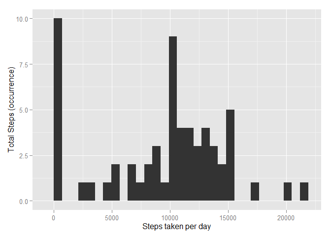
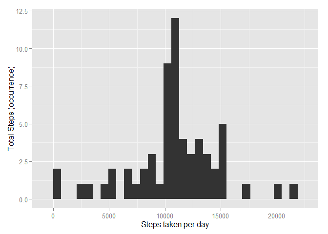

# Reproducible Research: Peer Assessment 1

## Global Setting

```r
knitr::opts_chunk$set(echo = TRUE, message = FALSE, fig.path='figure/')
```


## Loading and preprocessing the data

```r
if(!file.exists("activity.csv")) {
    unzip("activity.zip")    
}

readData <- read.table("activity.csv", sep = ",", header = T)
summary(readData)
```

```
##      steps                date          interval     
##  Min.   :  0.00   2012-10-01:  288   Min.   :   0.0  
##  1st Qu.:  0.00   2012-10-02:  288   1st Qu.: 588.8  
##  Median :  0.00   2012-10-03:  288   Median :1177.5  
##  Mean   : 37.38   2012-10-04:  288   Mean   :1177.5  
##  3rd Qu.: 12.00   2012-10-05:  288   3rd Qu.:1766.2  
##  Max.   :806.00   2012-10-06:  288   Max.   :2355.0  
##  NA's   :2304     (Other)   :15840
```


## What is mean total number of steps taken per day?

```r
require(ggplot2)
getActivityTotalStep <- function(data) {
    dailySum <- aggregate(data$steps, by=list(data$date), FUN=sum, na.rm=T)
    colnames(dailySum) <- c("date", "sum")
    
    print(qplot(dailySum$sum, 
          geom = "histogram",
          ylab = "Total Steps (occurrence)", 
          xlab = "Steps taken per day"))
    
    dailyMean <- mean(dailySum$sum)
    dailyMedian <- median(dailySum$sum)
    
    list(daily.mean=dailyMean, daily.median=dailyMedian)
}

dailyTotal <- getActivityTotalStep(readData)
```

 

The historgram chart show the steps taken per day, with average steps of **9354.2295082** with median of **10395** per day.


## What is the average daily activity pattern?

```r
getActivityPattern <- function(data) {
    dailyAvg <- aggregate(data$steps, by=list(data$interval), FUN=mean, na.rm=T)
    colnames(dailyAvg) <- c("interval", "avg")
    
    print(qplot(x = dailyAvg$interval, 
          y = dailyAvg$avg,
          geom = "line",
          ylab = "Average Steps", 
          xlab = "Interval"))
    
    dailyMax <- dailyAvg[dailyAvg$avg == max(dailyAvg$avg), ]
    list(daily.avg=dailyAvg, daily.maxInterval=dailyMax$interval, daily.maxAvg=dailyMax$avg)
}

dailyPattern <- getActivityPattern(readData)
```

 

On average across all the days in the dataset, the 5-minute interval that contains the maximum number of steps was found in interval **835** with an average steps of **206.1698113**.  


## Imputing missing values

```r
getImputingData <- function(data, dailyPattern) {
    naCount <- nrow(data[!complete.cases(data), ])
    newData <- data
    naIndex <- which(!complete.cases(data))

    # Strategy: Mean for that 5-minute interval.
    for (i in naIndex) {
        newData[i, ]$steps <- dailyPattern$daily.avg[dailyPattern$daily.avg$interval == newData[i, ]$interval, ]$avg
    }
    
    return(newData)
}

missing <- nrow(readData[!complete.cases(readData), ])
imputeData <- getImputingData(readData, dailyPattern)
newDailyTotal <- getActivityTotalStep(imputeData)
```

 

The new historgram chart show the steps taken per day after NA steps are imputed, with total missing data **2304**. We notice that average and median increases. New average steps **1.0766189\times 10^{4}** vs old average steps **9354.2295082**. New median **1.0766189\times 10^{4}** vs old median **10395**

The strategy to impute data is using mean for that 5-minute interval.

## Are there differences in activity patterns between weekdays and weekends?

```r
getWeekdayData <- function(data) {
    
    mydata <- data
    
    mydata$weekday <- weekdays(as.Date(mydata[ , ]$date, "%Y-%m-%d"))
    mydata$weekday.type <- ifelse(mydata$weekday == "Saturday" | mydata$weekday == 
                                          "Sunday", "Weekend", "Weekday")
    
    # convert column to factor
    mydata$weekday.type <- factor(mydata$weekday.type)
    weekdayAvg <- aggregate(mydata$steps, by=list(mydata$weekday.type, mydata$interval), FUN=mean, na.rm=T)
    
    colnames(weekdayAvg)<- c("Weekday", "Interval", "Avg.steps")
    
    return(weekdayAvg)
}


weekdayAvg <- getWeekdayData(imputeData)

require(lattice)
xyplot(weekdayAvg$Avg.steps ~ weekdayAvg$Interval | Weekday, weekdayAvg, type = "l", layout = c(1, 2), xlab = "Interval", ylab = "Number of steps")
```

 

Comparing Weekday and Weekend, the front interval of the day during weekday having more steps compare to weekend, where during weekend the steps distribution is more even during activity period.
